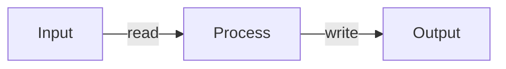
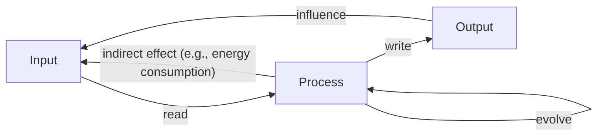

 
+++

title = "Hot topics and current challenges in ACSOS"
description = "Introductory presentation before the panel discussion"
outputs = ["Reveal"]

+++

# Hot topics and current challenges in ACSOS

## A very partial view from [Danilo Pianini](mailto:danilo.pianini@unibo.it)

---

### Living in an infinite transient

**Classic world**

We care about efficiency (in time and space)

**Classic world**

It is a *neverending transient*, what do we care about?

---

### Understanding (eternal) transients

* How do we understand if our perennial transient "works"?
  * Some cases can be dealt with control techniques
  * Many assumptions $\rightarrow$ Full complexity remains hard to capture
  * Systems that perform better on paper may perform worse in simulation
    * Models are too simple
    * Models of self are too simple

* Learn how to contain non-linear effects
  * There's potential for catastrophic *security* flaws

**How do we compare different approaches?**

* We lack *metrics* and *benchmarks*
  * Can we build a **library of *standard* evaluation tools**?

---

### Critical engineering feats

* Many tools over the years
* Few of them are actually reusable
  * Fewer are documented to the point that non-authors can do something
  * Ask experts in other disciplines on how to document for humans?
* Critical: **modularity and reusability**
  * Many ad-hoc ideas, few *reusable libraries*

We might want to build a catalog of ACSOS tools

reuse $\gg$ reinvent
